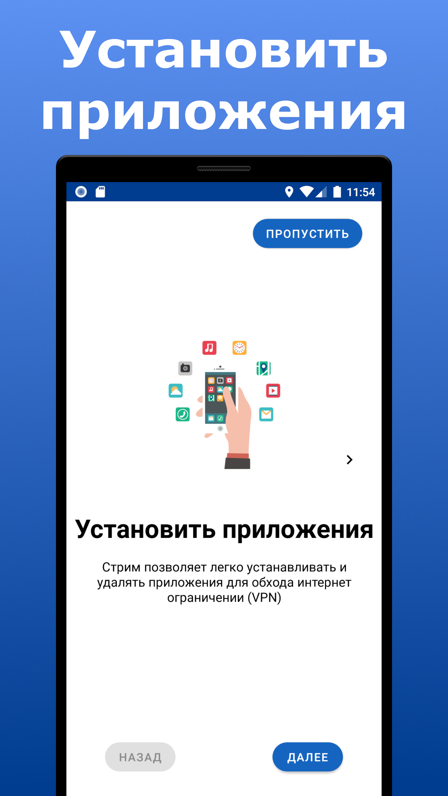
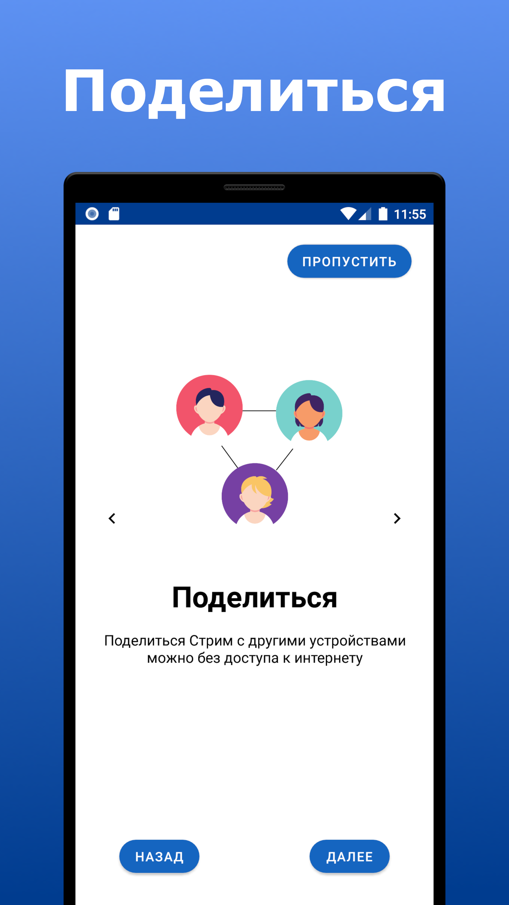
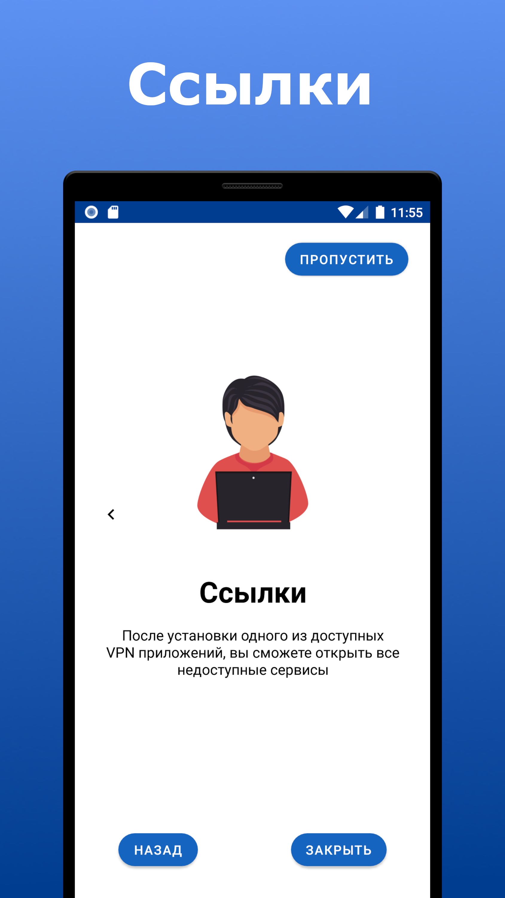
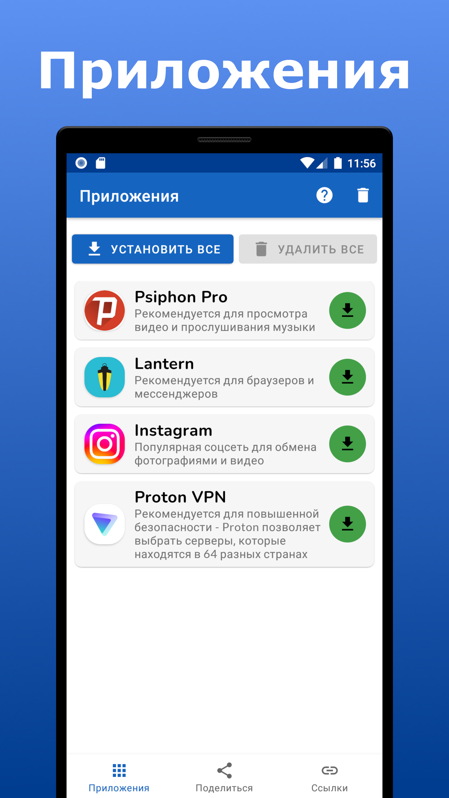
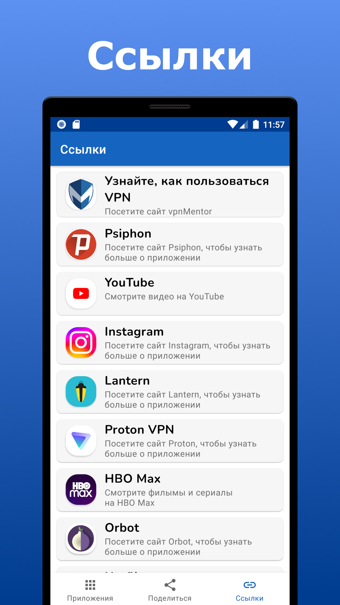
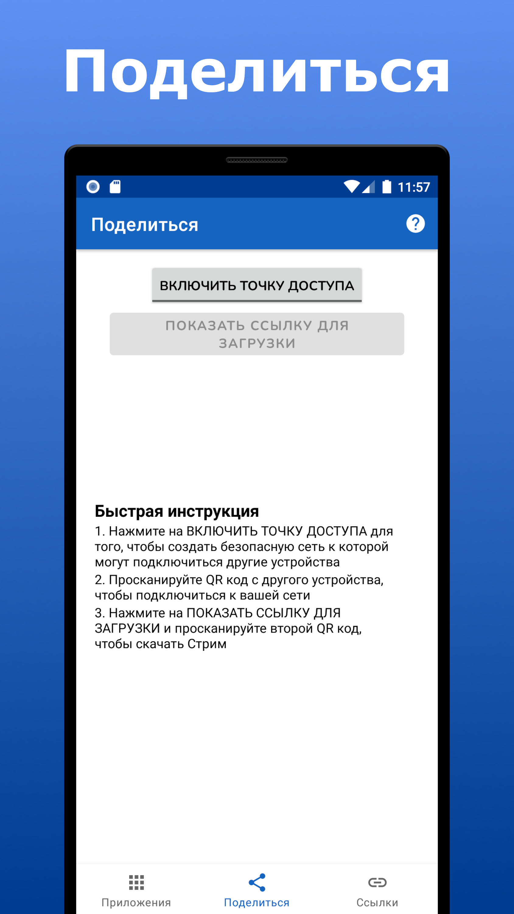

   
  <h1>СТРИМ</h1>
  
   
  <b>ПОДКЛЮЧАЙСЯ. ДЕЛИСЬ. СТРИМ.</b>

Стрим позволяет легко устанавливать и удалять различные приложения для обхода интернет ограничений (VPN). 
Приложением Стрим можно поделиться с кем угодно даже без доступа к интернету. 

## Скачать: [strim.apk](https://github.com/StrimConnected/Strim/releases/download/1.0.0/strim.apk)

 
 
 
